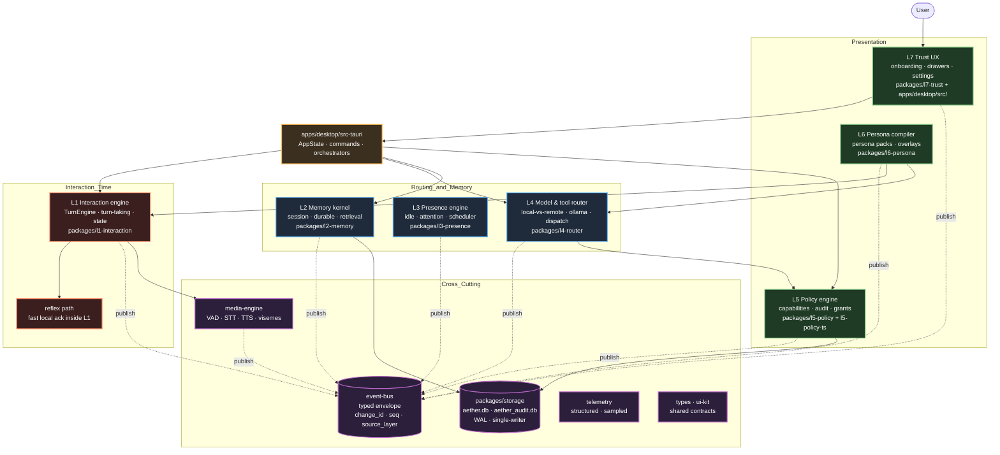
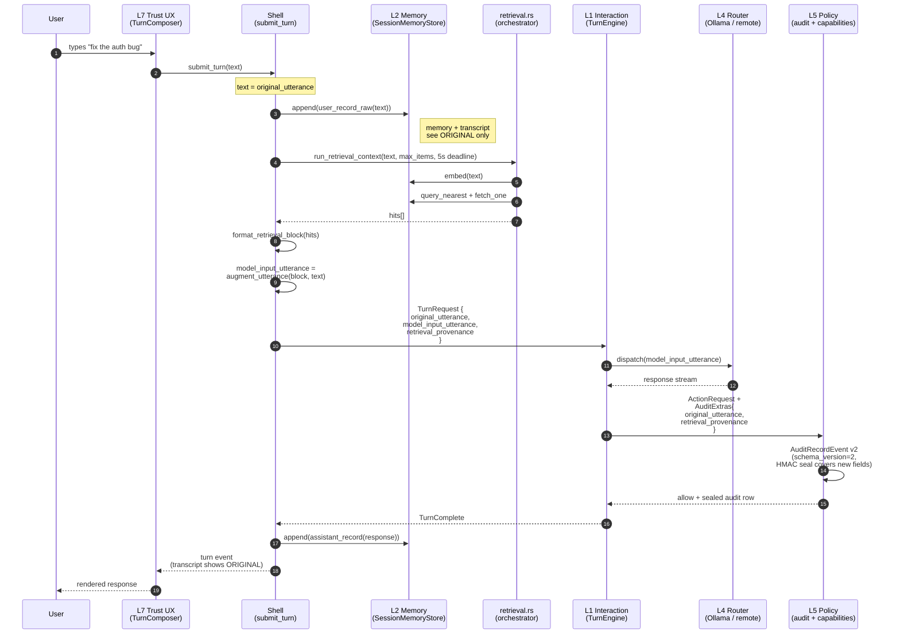
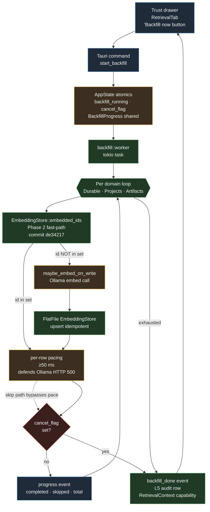
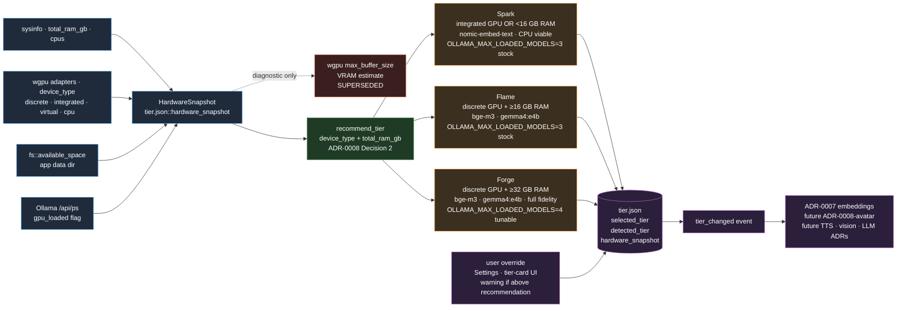

# Companion — Architecture Diagram

> **Status:** Onboarding reference.
> **Audience:** New contributors, portfolio readers, reviewers picking up the repo cold.
> **Last updated:** 2026-04-25 (autonomous architecture-diagram pass).

This document is a Mermaid-rendered visual companion to the canonical
architecture docs. It does NOT supersede them — when this file disagrees
with [ARCHITECTURE.md](../ARCHITECTURE.md)
or [docs/ARCHITECTURE-V2.md](ARCHITECTURE-V2.md),
the architecture docs win.

Four diagrams, each focused:

1. **7-layer overview** — the static skeleton.
2. **Event flow on a single user turn** — what happens when the user types.
3. **Backfill subsystem** — the embedding-onboarding side track (ADR-0007 D5).
4. **Hardware-tier model** — how the install adapts to the user's machine
   (ADR-0006 + ADR-0008).

Mermaid renders inline in GitHub Markdown and on `dbhavery.dev`'s
portfolio surface.

---

## Diagram 1 — Seven-layer overview

**What this shows.** The seven Companion layers stack from interaction-
time concerns at the bottom (L1, the only layer with a hard sub-100ms
budget) up through routing and memory (L2-L4) and into the
policy/presentation tier (L5-L7). Sibling crates do **not** import
each other — they coordinate through the typed `event-bus`
envelope. `packages/storage` is the only writer of disk state, and
the Tauri `apps/desktop/src-tauri` shell is the orchestrator that
wires layer outputs into the OS-level UI thread. The `media-engine`
is treated as cross-cutting because audio/video pipelines are owned
by their own timing budgets but feed L1 turn boundaries.

**What changed recently.** The L2 surface grew an embeddings module
and a per-domain retention sweep
([docs/MEMORY-V2-ARCHITECTURE.md](MEMORY-V2-ARCHITECTURE.md) §10),
landing through ADR-0001 → ADR-0005. The L5 audit row grew a
schema-v2 shape (ADR-0009, commit `b577105`) — that change is
detail rather than skeleton, so it shows in Diagram 2 instead of
here. New shell modules `tier.rs`, `hardware.rs`, `backfill.rs`,
and `retrieval.rs` landed in the M2 Run 2/3 sessions
(ADR-0006/0007/0008/0009).

**Cross-references.** Layer responsibilities and the
no-collapse rule live in
[ARCHITECTURE.md](../ARCHITECTURE.md)
§2.2 and the layer interface packs described in
[docs/ARCHITECTURE-V2.md](ARCHITECTURE-V2.md).
The event-bus contract lives in
[packages/event-bus/src/lib.rs](../packages/event-bus/src/lib.rs).

---

## Diagram 2 — Event flow on a single user turn

**What this shows.** A single user turn fans out through the shell
into three independent persistence/control concerns: memory append
(verbatim original text), retrieval context (embed → query →
augment), and the routed model call. The two-channel split means
the user always sees **what they typed** in the transcript and
**what they typed** in the audit row, while the router still
receives the augmented prompt that gives the model retrieval
context. The 5-second wall-clock bailout in `run_retrieval_context`
ensures a slow embedder never stalls the turn — failure becomes
"no retrieval block" rather than "no response."

**What changed recently.** ADR-0005 (commit landed M2 Run 2) wired
retrieval into `submit_turn`. ADR-0009 (commits `f378ea5`,
`16a3db2`, `b577105`, ratified 2026-04-25) split `TurnRequest`
into `original_utterance` + `model_input_utterance` and bumped the
L5 audit row to schema v2 with optional `retrieval_provenance`.
HMAC sealing in `audit_seal.rs` was extended to cover the new
fields — without that, an attacker could mutate `original_utterance`
post-write and the chain would still verify. The frontend
`AuditRow` component renders v1 with a "pre-ADR-0009" schema badge
and v2 with the user's text as the headline.

**Cross-references.**
[apps/desktop/src-tauri/src/commands.rs](../apps/desktop/src-tauri/src/commands.rs)
(`submit_turn`),
[apps/desktop/src-tauri/src/retrieval.rs](../apps/desktop/src-tauri/src/retrieval.rs),
[packages/l1-interaction/src/turn.rs](../packages/l1-interaction/src/turn.rs),
[packages/l5-policy/src/audit.rs](../packages/l5-policy/src/audit.rs),
[docs/adr/ADR-0005-retrieval-wiring.md](adr/ADR-0005-retrieval-wiring.md),
[docs/adr/ADR-0009-retrieval-augmented-utterance-audit-reach.md](adr/ADR-0009-retrieval-augmented-utterance-audit-reach.md).

---

## Diagram 3 — Backfill subsystem (ADR-0007 D5 + Phase 2)

**What this shows.** Backfill walks every embed-eligible memory row
written before `embeddings.enabled` flipped on, and re-embeds it
through the same path live writes use. The ADR-0007 D5 design is
opt-in (button in the Retrieval tab, hidden when `N=0`),
hardware-aware (estimate is computed from the tier's embedding
latency profile per ADR-0007 D7), and cancellable at every row
boundary. Phase 2 (commit `de34217`, 2026-04-25) added the skip-
already-embedded fast path: the worker asks `EmbeddingStore::
embedded_ids(domain)` for the set of memory ids already vectorised,
then skips matching rows during the walk. Skipped rows count into
`BackfillProgress::skipped_already_embedded` rather than `completed`,
so the UI renders "skipped X" without inflating the indexed count.
The 50 ms pacing pause defends against the rapid-fire Ollama
HTTP 500 surfaced in validation Block 9.

**What changed recently.** The whole subsystem is recent —
ADR-0007 was Accepted 2026-04-24 and the implementation landed
across Sessions A and B that week. The skip-fast-path
(`ba911eb` adds the trait method, `de34217` wires it into the
worker) is the most recent layer of polish. The next deferred
work item is the in-app `[Pull model]` button (ADR-0007 D4) and
backfill resumability across app restart (ADR-0007 Open items).

**Cross-references.**
[apps/desktop/src-tauri/src/backfill.rs](../apps/desktop/src-tauri/src/backfill.rs),
[packages/l2-memory/src/embeddings.rs](../packages/l2-memory/src/embeddings.rs),
[docs/adr/ADR-0007-embeddings-onboarding.md](adr/ADR-0007-embeddings-onboarding.md),
[docs/MEMORY-V2-ARCHITECTURE.md](MEMORY-V2-ARCHITECTURE.md) §9
"Embedding backfill".

---

## Diagram 4 — Hardware-tier model (ADR-0006 + ADR-0008)

**What this shows.** The tier model is the one hardware-adaptation
axis in Companion — every downstream subsystem (embeddings today;
avatar / TTS / vision / LLM in future ADRs) reads `tier.json` and
adapts, rather than reinventing hardware detection. Detection
runs once at first launch and on demand from Settings, populating
`HardwareSnapshot` from `wgpu` adapter info, `sysinfo`, disk, and
Ollama's process status. The tier is then resolved by the rule in
`recommend_tier`, persisted to `tier.json`, and a `tier_changed`
event lets every subscriber re-read its own onboarding state. The
50% headroom rule (ADR-0006 Constraint 2) means the recommended
tier is the highest one that fits in *half* the detected resources,
leaving the user's machine usable for games, browsers, and other
AI work.

**What changed recently.** ADR-0006 (Accepted 2026-04-24) landed
the original tier model with VRAM estimated from
`wgpu::Limits::max_buffer_size`. On-hardware validation that same
day revealed `max_buffer_size` is fundamentally unreliable cross-
backend — Vulkan reports `u64::MAX` as a sentinel on Don's
24 GB RTX 3090 Ti, while DX12 reports 1 GB on the same card.
**ADR-0008** (Accepted 2026-04-24, mid-run) replaced the rule
with a `device_type` + `total_ram_gb` classification and
demoted `vram_gb_estimate` to diagnostic-only. The newest layer
(commit `ad6a457`, 2026-04-25) added `OLLAMA_MAX_LOADED_MODELS=4`
as a Forge tier-tunable, after Phase 3C measured Ollama's stock
3-slot cap evicting `gemma4:e4b` while ~7.8 GB VRAM was free —
slot count, not byte count, was the binding constraint.

**Cross-references.**
[apps/desktop/src-tauri/src/hardware.rs](../apps/desktop/src-tauri/src/hardware.rs),
[apps/desktop/src-tauri/src/tier.rs](../apps/desktop/src-tauri/src/tier.rs),
[docs/adr/ADR-0006-hardware-tier-model.md](adr/ADR-0006-hardware-tier-model.md),
[docs/adr/ADR-0008-tier-detection-from-device-type-and-ram.md](adr/ADR-0008-tier-detection-from-device-type-and-ram.md).
The 2026-04-24 on-hardware validation run and the 2026-04-25
multi-model ceiling report are summarised in ADR-0006 and ADR-0008.

---

## Reading order for new contributors

1. [ARCHITECTURE.md](../ARCHITECTURE.md)
   — what Companion is and what it refuses to be.
2. [CLAUDE.md](../CLAUDE.md) §1.4 + §5 — layer-boundary and event rules.
3. This file — visual orientation across the four most-asked questions.
4. [docs/ARCHITECTURE-V2.md](ARCHITECTURE-V2.md)
   — the canonical engine breakdown.
5. [docs/MEMORY-V2-ARCHITECTURE.md](MEMORY-V2-ARCHITECTURE.md)
   — the most evolved subsystem; sets the pattern for the others.
6. ADR sequence 0001 → 0009 in [docs/adr/](adr/) — follow the
   reasoning trail of how the current shape was reached.

## How this doc stays honest

Mermaid diagrams are rendered by GitHub on every push, so a
syntax break is visible immediately. Cross-references to source
files are not currently rot-guarded by
`tools/lint-memory-doc/check.py` or the sibling linters — that's
an open gap (this doc is descriptive, not contract-load-bearing).
If a referenced file is renamed, update the link in the same PR
that does the rename. When an ADR is added beyond ADR-0009 and it
materially changes one of the four flows here, append a "Diagram
N+1" or amend the affected diagram and note the ADR in the
"What changed recently" paragraph.
